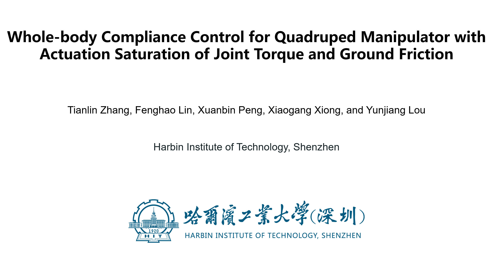

# qm_control

## Overview

The branch makes the quadruped manipulator whole-body compliance with actuation saturation. To be specific, in the case of non-saturation, the controller tracks user-set compliance. In case of saturation, it can avoid unsafe behaviors (e.g., slips, oscillations, and overshoots) caused by actuation saturation.

## Video

(Click to see)
[](https://youtu.be/EUXxHV2ZGMQ)


## Usage

Launch the simulation with:

```
mon launch qm_gazebo empty_world.launch
```

Load the controller with:

```
mon launch qm_controllers load_controller.launch
```

Start the controller using `rqt_controller_manager` GUI with:

```
rosrun rqt_controller_manager rqt_controller_manager
```

After the manipulator is initialized, commands can be sent with: 

```
# Don't use mon
roslaunch qm_controllers load_qm_target.launch 
# rviz
mon launch qm_controllers rviz.launch
```

[dynamic_reconfigure](http://wiki.ros.org/dynamic_reconfigure) is set to expose parameters to external reconfiguration, such as the torque limit, friction coefficient, stiffness, damping, and so on.

```
rosrun rqt_reconfigure rqt_reconfigure
```


## External force test

-   You can call the service to apply external force $[50.0, 0.0, 0.0]^T$ to the end-effector for 2 seconds.

```
rosservice call /gazebo/apply_body_wrench '{body_name: "qm::ft_sensor", reference_frame: "qm::ft_sensor", wrench: { force: { x: 50.0, y: 0, z: 0 } }, start_time: 0, duration: {secs: 2} }'
```

-   You can call the service to apply external force $[50.0, 0.0, 0.0]^T$ to the base for 2 seconds.

```
rosservice call /gazebo/apply_body_wrench '{body_name: "qm::base", reference_frame: "qm::base", wrench: { force: { x: 50.0, y: 0, z: 0 } }, start_time: 0, duration: {secs: 2} }'
```
